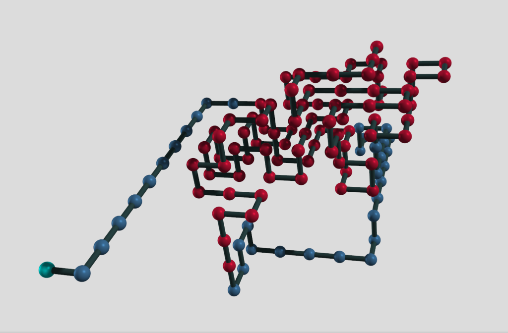

# ElfPSP_AntColony

<a href="https://mjsaldanha.com"></a>

Implementations of a Protein Structure Prediction (PSP) program, using an Ant Colony optimization algorithm.


Index
---

- [Overview](#overview)

- [Requirements](#requirements)

- [Compiling](#compiling)

- [Usage](#usage)

- [Output Format and Visualization](#output)

- [Configuring Internal Parameters](#configuring)


<a name="overview"></a>
Overview
---

In this repository is my implementation of a Protein Structure Prediction (PSP) program found in the literature, which I analyzed and optimized in various ways, which is why there are multiple versions of the implementation.

The PSP program in question is the one described in the Reference below.

> Chu, Daniel, and Albert Zomaya. "Parallel ant colony optimization for 3D protein structure prediction using the HP lattice model." Parallel Evolutionary Computations. Springer, Berlin, Heidelberg, 2006. 177-198.

The authors provide some distributed versions of the ACO algorithm, which they implemented using MPI. We chose to implement the version in which ant colonies are connected in a unidirectional ring, and each colony passes its best ant to the next colony. This exchange is done once per cycle of the colonies.

I've been investigating their proposal due to my [research project](https://mjsaldanha.com/sci-projects/1-psp-project-1/). On a higher level, we implemented both the sequential algorithm and its parallelization with MPI, as described by the authors. Each of these 2 versions also come with 2 other parallelizations (on a lower level):

- **OpenMP**: Multithreaded parallelization of the activity of the ants;

- **CUDA**: GPU parallelization in which the code performed by each ant is performed entirely by a single CUDA thread.

The authors of the algorithm mentioned that the ants perform a backtracking procedure if they reach a dead end. We have implemented and experimented versions with and without the backtracking procedure, and the version with backtracking didn't shown any benefits, on the contrary, it was slightly worse on average. The reasoning was that ants in reality don't have enough memory to perform backtracking in real life, so the authors' proposed algorithm didn't simulate the behavior of ants, as an ACO algorithm usually attempts to. Hence, there are versions with and without backtracking, which we produced as was seen suitable. The produced versions are:

- `prog_bt_mpi` - MPI parallelization of the version with backtracking

- `prog_bt_mpi_omp`- MPI parallelization of the version with backtracking and OpenMP parallelization

- `prog_nbt_mpi` - MPI parallelization of the version without backtracking

- `prog_nbt_mpi_cuda` - MPI parallelization of the version without backtracking and with CUDA parallelization

- `prog_nbt_mpi_omp` - MPI parallelization of the version without backtracking and with OpenMP parallelization

- `prog_bt` - Sequential version with backtracking

- `prog_bt_omp` - Version with backtracking and OpenMP parallelization

- `prog_nbt` - Sequential version without backtracking

- `prog_nbt_cuda` - Version without backtracking and with CUDA parallelization

- `prog_nbt_omp` - Version without backtracking and with OpenMP parallelization


<a name="requirements"></a>
Requirements
---

Requirements vary depending on the program version you'd like to compile.

Versions with MPI parallelization require the libraries `openmpi` or `mpich` or any library that provides the `mpirun` command.

Versions with CUDA parallelization require the `nvcc` compiler.

Versions with OpenMP parallelization require your C compile to support the flag `-fopenmp` (e.g. `gcc -fopenmp prog.c -o prog`).

<a name="compiling"></a>
Compiling
---

If you run `make`, it will make all the program versions. The versions are called as described in [Overview](#overview), so you can make them separately with the commands below.
```makefile
make prog_bt_mpi
make prog_nbt
make prog_nbt_omp
make prog_bt_mpi_omp
```

Compiling generates a lot of cumbersome files, which can be cleaned with `make clean`.

<a name="usage"></a>
Usage
---

When you run `make`, many binary executable files will be built in the root of the directory. The ones that don't use MPI can be run as any other executable file

```
$ ./prog_nbt -h
Usage: ./prog_nbt [-h] [-s hp_sequence] [-c num_cycles] [-a num_ants]

    -h       displays this help message
    -s arg   the HP sequence of the protein to predict
    -c arg   number of cycles that the ant colony should perform
    -a arg   number of ants in the ant colony
```

As you can see, the program accepts 3 optional parameters on command line. Many input parameters can also be specified through the [configuration.yml](configuration.yml) file in the root of the directory.

An example of usage and output is as follows:

```
$ ./prog_nbt -s HHHHHHPPHHHHHHHPPHH -c 1000 -a 70
Contacts: 25
```

where `contacts` is the number of hydrophobic contacts in the structure predicted.

Unlike the sequential versions, the parallel versions should be executed using the `mpirun` command, like follows:

```
$ mpirun -n 2 ./prog_nbt_mpi -s HHHHHHHPPHHHHPPPHHHH
Contacts: 23
```

<a name="output"></a>
Output Format and Visualization
---

The predicted protein structure is saved in file `output.json` by default, unless some filename has been specified in the configuration file.

The structure can be visualized using a Python script provided in the `tools/` directory, as follows:

```
python3 ./tools/hpProteinPlotter.py ./output.json
```

Which should show a GUI for visualizing and interacting with the protein structure. However, you need to have installed `vtk` in your computer (it needs to be compiled from source), as well as have the python3 module `vtk`. Installing VTK is a difficult process, but provides an outstanding visualization experience. An example of visualization is given below.



<a name="configuring"></a>
Configuring Internal Parameters
---

The program has a number of internal parameters that can be configured. All the parameters can be changed in the file [configuration.yml](configuration.yml); each parameters is also described in such file.

For example, the default number of ants exchanged by colonies is 5, but you can change it in the configuration file, as:

```
EXCHANGED_ANTS: 8
```

Although the file has YAML extension, it can't be restructured as any YAML file. Please, only change the values within this file, without reordering the parameters or adding newlines; the program might not recognize the file contents depending on how it is changed.

Some parameters, such as HP_CHAIN, can also be passed as argument to the program. Arguments have precedence over what is within the [configuration.yml](configuration.yml) file.
